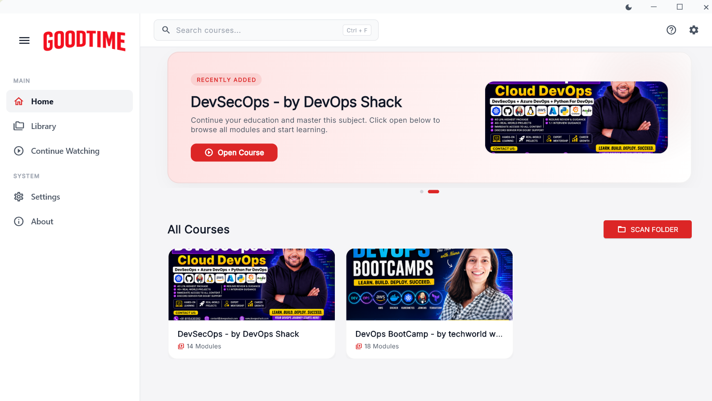
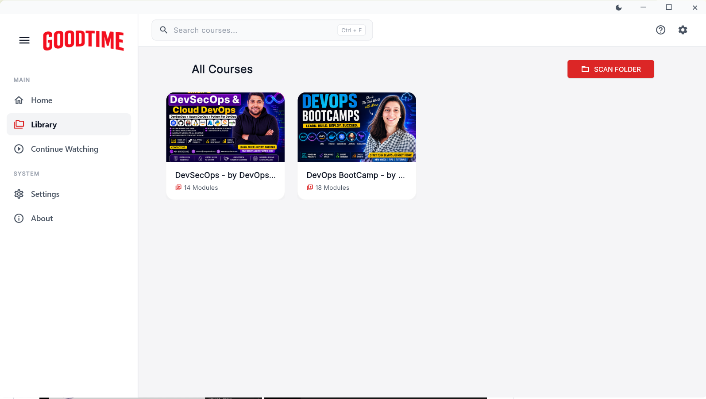
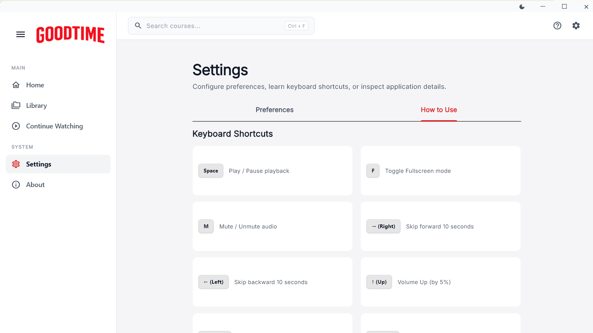
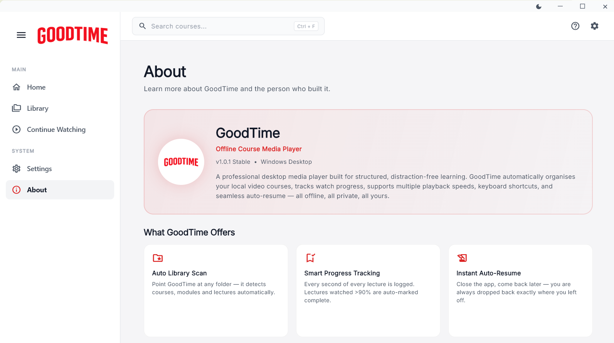
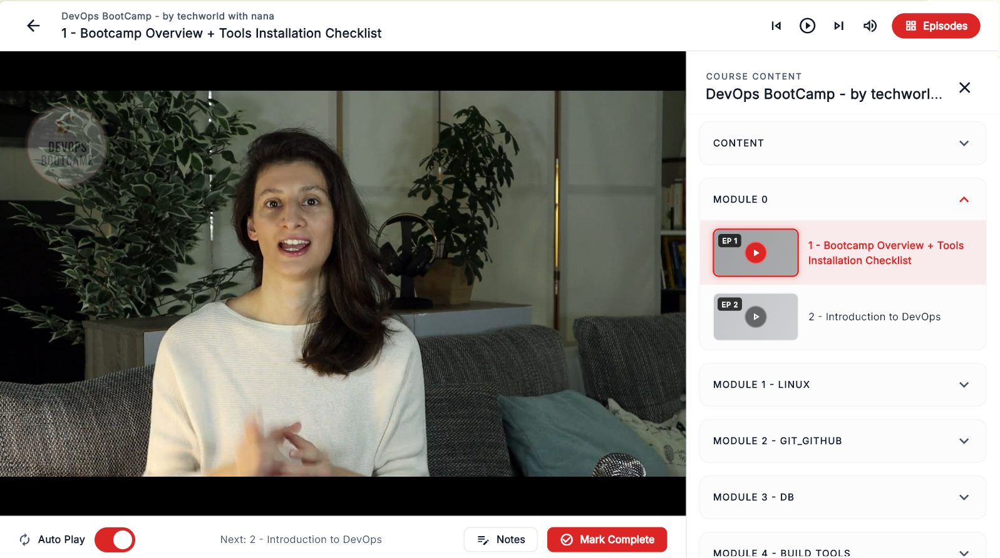
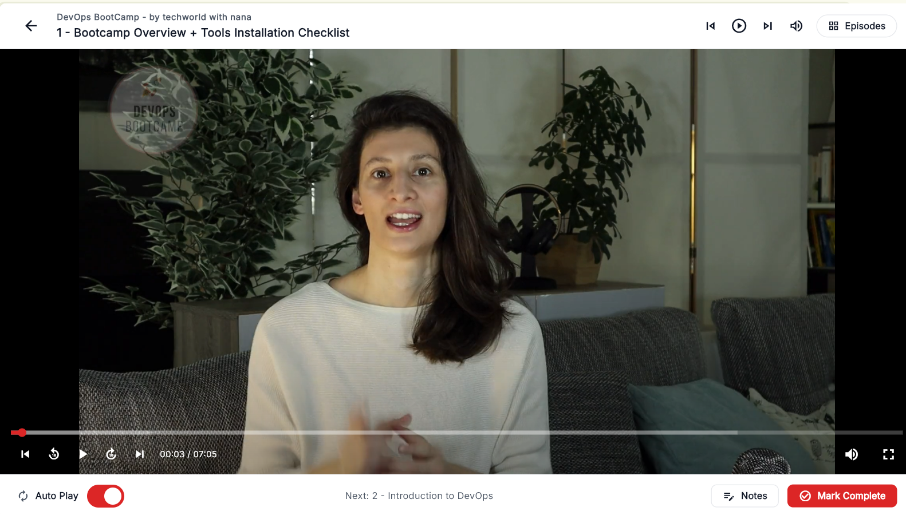
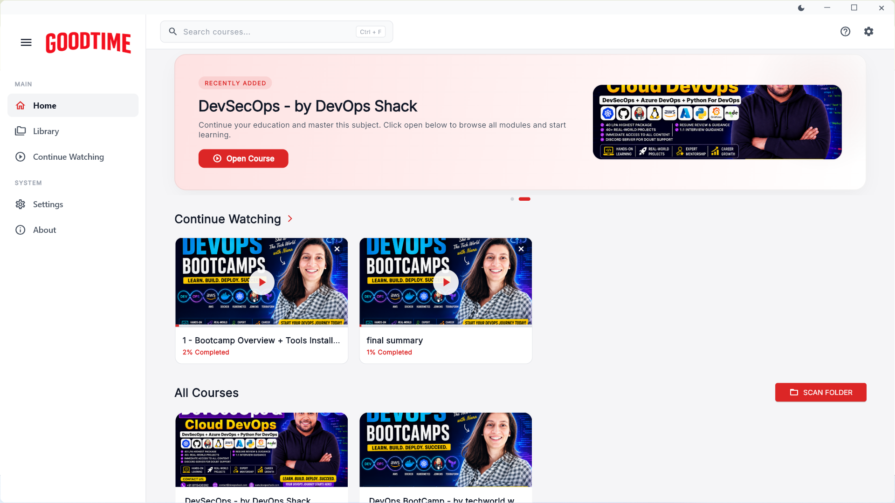

<div align="center">
  
  
  # GoodTime Media Player
  
  ### *Your Cinematic Offline Netflix Experience for Learning.*
  
  <br/>

  <p align="center">
    <strong>A breathtaking, Netflix-inspired desktop media player specifically designed for organizing, managing, and binge-watching your offline downloaded lectures, courses, and educational content.</strong>
  </p>

  <br/>

  <p align="center">
    <a href="https://github.com/manoj-chavan-13/GoodTimes/releases">
      
    </a>
    <a href="https://github.com/manoj-chavan-13/GoodTimes/releases">
      
    </a>
    
    
  </p>
</div>

<hr/>

With an uncompromising emphasis on a premium, cinematic user experience, GoodTime magically transforms disorganized folders of downloaded videos into a sleek, professional streaming-platform-like interface—completely offline and safely on your local machine.

## ✨ Features

- **Netflix-Inspired UI:** A cinematic, premium interface featuring dynamic gradients, smooth hover effects, royal color palettes, and auto-generated dynamic thumbnails.
- **Smooth Cinematic Transitions:** Experience seamless cross-fades and elegant slide animations throughout the app—from opening courses and switching lectures to collapsing the sidebar—delivering a truly premium, native feel.
- **Smart Folder Scanning:** Simply point the application to your root directory containing your downloaded courses. GoodTime automatically parses the folder structure and neatly organizes everything into Courses, Modules, and Episodes.
- **Intelligent "Continue Watching":** Automatically tracks your exact watch progress and position. The home screen presents a dynamic "Continue Watching" section that lets you resume right where you left off.
- **Autoplay & Binge-Watching:** Seamlessly jumps to the next lecture—even across different modules—once the current episode finishes.
- **Adjustable Playback Speed:** Essential for lectures and educational content; easily adjust playback speeds (0.5x, 0.75x, 1.0x, 1.25x, 1.5x, 2.0x) on the fly with convenient keyboard shortcuts.
- **Dedicated About & Settings Modules:** Built-in screens for managing preferences, learning keyboard shortcuts, and exploring application details right from the sidebar.
- **Custom Window Controls:** A sleek, borderless, frameless window experience with custom minimize, maximize, and close controls built seamlessly into the UI.
- **100% Offline First:** Built entirely for local media consumption. No internet connection required. All watch history and metadata are securely stored locally on your machine.

## 📸 See It In Action (Simple but the Best)

<div align="center">
  
  <br/>
  <i>Sleek, Netflix-inspired interface with dynamic auto-generated thumbnails.</i>
</div>

<br/>

<div align="center">
  
  
</div>

<div align="center" style="margin-top: 15px;">
  
  
</div>

<div align="center" style="margin-top: 15px;">
  
  
</div>

## 📥 Download & Installation

You can install GoodTime in two ways: via the direct MSIX installer or by downloading the portable ZIP file.

### Option 1: Direct Installer (Recommended)
1. Go to the [Releases](https://github.com/manoj-chavan-13/GoodTimes/releases) page.
2. Download the `GoodTime-Installer.msix` file from the latest release.
3. **Important Note on Installation:** Because this is a self-signed open-source application, you need to trust the developer certificate to install it:
   - Right-click the downloaded `.msix` file -> **Properties** -> **Digital Signatures** tab.
   - Select the signature, click **Details**, then **View Certificate**, and click **Install Certificate**.
   - Choose **Local Machine**, and click **Browse** to select **Trusted Root Certification Authorities**.
   - After a successful import, double-click the `.msix` file to install it seamlessly as a native Windows app!

### Option 2: Portable ZIP
1. Go to the [Releases](https://github.com/manoj-chavan-13/GoodTimes/releases) page.
2. Download the `GoodTime-Windows-Release.zip` file.
3. Extract the contents to any folder (e.g., your Desktop or Documents).
4. Double-click `playit.exe` to launch the application.

> **⚠️ Windows SmartScreen Warning (Please Read)**
> If you see a blue warning screen saying "Windows protected your PC", it simply means the app isn't digitally signed with an expensive enterprise certificate. 
> **To bypass this:** Click on **"More info"** and then click **"Run anyway"**. 

## 🔒 Your Data is Safe (100% Offline)
This application is **purely offline**. We do not collect, track, or send ANY of your data, files, or watch history over the internet. Everything runs locally on your machine and stays exactly where it belongs—with you. The entire source code is completely **open source**, so you can verify this yourself!

## 🚀 Building from Source

### Prerequisites

- [Flutter SDK](https://docs.flutter.dev/get-started/install) installed on your system.
- Windows Desktop development requirements (Visual Studio with C++ workload).

### Build Steps

1. Clone this repository to your local machine.
2. Navigate to the project directory and fetch dependencies:
   ```bash
   flutter pub get
   ```
3. Run the application in development mode:
   ```bash
   flutter run -d windows
   ```
4. To build the final release executable:
   ```bash
   flutter build windows --release
   ```
   The generated executable will be located in `build/windows/x64/runner/Release/playit.exe` (or `goodtime.exe` depending on your executable name configuration).

## 🛠 Built With

- **[Flutter](https://flutter.dev/)** - UI Toolkit for crafting natively compiled applications.
- **[Riverpod](https://riverpod.dev/)** - Reactive caching and data-binding framework for state management.
- **[MediaKit](https://github.com/media-kit/media-kit)** - High-performance video playback engine.
- **[Hive](https://docs.hivedb.dev/)** - Lightweight and blazing fast local NoSQL database.
- **[Window Manager](https://pub.dev/packages/window_manager)** - For custom frameless desktop window management.

## 📁 Recommended Folder Structure

To get the most out of GoodTime's automatic scanner, structure your offline downloads like this:
```text
Root Folder/
│
├── Course 1/
│   ├── Module 1/
│   │   ├── 01 - Introduction.mp4
│   │   └── 02 - Basics.mp4
│   └── Module 2/
│       └── 01 - Advanced.mp4
│
└── Course 2/
    └── Module 1/
        └── 01 - Welcome.mp4
```

## 📄 License

This project is licensed under the MIT License - see the [LICENSE](LICENSE) file for details.
